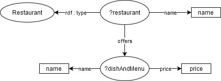
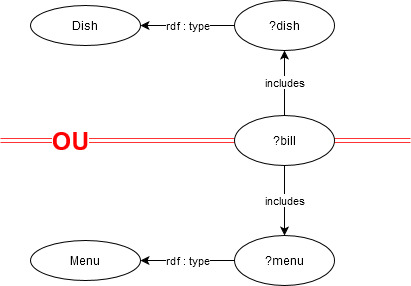

<link rel="stylesheet" type="text/css" media="all" href="./css/mdstyle.css" />

# Rapport Mini-Projet

## MAS-RAD 4 : Introduction au Web des données

## Kevin Dubois

## Travail rendu le 07/06/2020

### Lien GitHub : [https://github.com/CH-KevinDubois/MAS-RAD-4-WEB-Mini-Projet](https://github.com/CH-KevinDubois/MAS-RAD-4-WEB-Mini-Projet)

<div style="page-break-after: always;"></div>

## Table des matières
  * [RDFs : Description du modèle](#rdfs-:-description-du-modèle)
    + [Intro : quelques mots sur mon modèle](#intro-:-quelques-mots-sur-mon-modèle)
    + [Classes : description avec les attibuts associés](#classes-:-description-avec-les-attibuts-associés)
    + [Object properties : liste complète avec Domain et Range](#object-properties-:-liste-complète-avec-domain-et-range)
    + [Inférences : deux idées](#inférences-:-deux-idées)
  * [RDF : instanciation du modèle](#rdf-:-instanciation-du-modèle)
  * [Requêtes SPARQL](#requêtes-sparql)
  * [Analyse et compréhension RDFa](#analyse-et-compréhension-rdfa)
    + [Remarques](#remarques)
    + [Sites analysés](#sites-analysés)
    + [Indexation des pages par Google](#indexation-des-pages-par-google)
    + [Affichage à l'utilisateur](#affichage-à-l'utilisateur)
    + [Sources](#sources)
  * [Conclusions](#conclusions)

<div style="page-break-after: always;"></div>

## RDFs : Description du modèle
### Intro : quelques mots sur mon modèle
Le modèle tente de décrire simplement les interactions, les actions et les acteurs présents dans un restaurant. 
Le modèle est volontairement simplifié, mais pas trop afin de respecter les contraintes posées par les données mini-projet. Pour décire en deux mots le modèle : l'acteur principal est le restaurant qui possède des employés et qui est visité par des clients. Les employés servent les clients, émettent les factures, cuisinent les plats, ... . Alors que les clients choisissent des plats proposés dans la carte et peuvent donner des notes en fin de repas.  


### Classes : description avec les attibuts associés
* Restaurant : Un restaurant. Il a un nom, un numéro de téléphone et des employées.
* dbo:Person : Une personne avec un nom. Non instanciée, utilisée pour l'héritage.
* Employee : Un employé avec un salaire. Il travaille pour un restaurant et fait des réservations. Non instancié.
* Cook : Un cusinier. Il commande les commandes les produits et prépare les plats.
* Waiter : Un serveur. Il s'occupe des tables et émet les factures.
* Manager : Un manager. Il supervise les employées (donc possiblement d'autres managers), édite les factures et annule les réservations.
* Custormer : Un client avec un numéro de téléphone. Il fait une réservation et, à la fin du repas sur une base volontaire, note la préstation.
* Rank : Un classement avec une note. Il note un restaurant et une réservation sur la nourriture, le service et l'ambience. 
* Reservation : Une réservation avec une date de saisie et une date et heure cible. Elle est liée a une table.
* Table : Une table avec un numéro unique et le nombre de personnes pouvant y être assis. 
* Bill_of_sale : Une facture avec un pourboire. Elle est le total de l'addition des plats et des menus.
* Menu : Un menu avec un prix et un nom. Il contient des plats.
* Dish : Un plat avec un prix et un nom. Il est constitué de produits.
### Object properties : liste complète avec Domain et Range
* offers :
    * RDFS:domain => Restaurant
    * RDFS:Range => Dish
* offers :
    * RDFS:domain => Restaurant
    * RDFS:Range => Menu
* works_for :
    * RDFS:domain => Employee
    * RDFS:Range => Restaurant
* has_taken :
    * RDFS:domain => Employee
    * RDFS:Range => Reservation
* supervises :
    * RDFS:domain => Manager
    * RDFS:Range => Employee
* has_edited :
    * RDFS:domain => Manager
    * RDFS:Range => Bill_of_sale
* has_edited :
    * RDFS:domain => Manager
    * RDFS:Range => Reservation
* looks_after :
    * RDFS:domain => Waiter
    * RDFS:Range => Table
* has_emitted :
    * RDFS:domain => Waiter
    * RDFS:Range => Bill_of_sale
* perpares :
    * RDFS:domain => Cook
    * RDFS:Range => Dish
* has_made :
    * RDFS:domain => Customer
    * RDFS:Range => Reservation
* has_made :
    * RDFS:domain => Customer
    * RDFS:Range => Rank
* ranks :
    * RDFS:domain => Rank
    * RDFS:Range => Restaurant
* ranks :
    * RDFS:domain => Rank
    * RDFS:Range => Reservation
* is_linked :
    * RDFS:domain => Table
    * RDFS:Range => Reservation
* is_linked :
    * RDFS:domain => Bill_of_sale
    * RDFS:Range => Reservation
* includes :
    * RDFS:domain => Bill_of_sale
    * RDFS:Range => Menu
* includes :
    * RDFS:domain => Bill_of_sale
    * RDFS:Range => Dish
* contains :
    * RDFS:domain => Menu
    * RDFS:Range => Dish
### Inférences : deux idées
Une première idée est d'inférer la somme totale de la facture connaissant le prix ainsi que la quantité de menus et des plats commandés. 
Une seconde idée, comme nous avons les liens entre tous les acteurs d'un restaurant, est de mettre en relation le classement donné par client, l'équipe en charge de la table, ainsi que le pourboire laissé avec la facture. Selon une certaine pondération du classement et du pourboire, il est possible d'évaluer la performance de l'ensemble des employés, et par inférence de leur ajouter une propriété qui est la moyenne des notes reçues dans le passé.
## RDF : instanciation du modèle

La totalité des individus déclarés se retrouvent dans les graphiques suivants :  


## Requêtes SPARQL
1.  Requête : execQueryGetEmployees  
    Description : Trouver tous les employés.  
    Utilité : Trouver tous les employés.  
    Constuction : Je recherche toutes les subclasses de Employee et ensuite toutes les instances des ces subclasses (fait comme ceci car pas de reasoner).  
    Graph :  
    
    ```java
    PREFIX db: <http://dbpedia.org/resource/>  
	PREFIX onto: <http://dbpedia.org/ontology/>   
	PREFIX rdf: <http://www.w3.org/1999/02/22-rdf-syntax-ns#>
	PREFIX rdfs: <http://www.w3.org/2000/01/rdf-schema#> 
	PREFIX ns: <http://www.semanticweb.org/Kevin/Mini-projet/Ressources/>
	select distinct ?employee where { 
		?x rdfs:subClassOf ns:Employee . 
		?employee rdf:type ?x . 	
	};
    ```
    Resulats attendus : 
    ```java 
    http://www.semanticweb.org/Kevin/Mini-projet/Ressources/jules
    http://www.semanticweb.org/Kevin/Mini-projet/Ressources/nicolas
    http://www.semanticweb.org/Kevin/Mini-projet/Ressources/philippe
    ```

2.  Requête : execQueryGetHigherDishPrice  
    Description : Optenir les 2 prix les plus élevés des plats.  
    Utilité :  Optenir les deux prix les plus élevés.  
    Constuction : Je recherche les plats, les prix associés, j'ordonne de façon DESC et je limite à deux résultats.  
    Graph :  
     
    ```java
    PREFIX db: <http://dbpedia.org/resource/>  
	PREFIX onto: <http://dbpedia.org/ontology/>   
	PREFIX rdf: <http://www.w3.org/1999/02/22-rdf-syntax-ns#>
	PREFIX rdfs: <http://www.w3.org/2000/01/rdf-schema#> 
	PREFIX ns: <http://www.semanticweb.org/Kevin/Mini-projet/Ressources/>
    "select distinct ?price where { 
		?dish rdf:type ns:Dish . 
		?dish ns:price ?price . 	
	} 
	ORDER BY DESC(?price) 
	LIMIT 2	
	};
    ```
    Resulats attendus : 
    ```java 
    "22.0"^^<http://www.w3.org/2001/XMLSchema#decimal>
    "18.0"^^<http://www.w3.org/2001/XMLSchema#decimal>
    ```

3.  Requête : execQueryGetReservationOf  
    Description : Optenir les réservations d'un client.  
    Utilité :  Optenir les réservations d'un client.  
    Constuction : Je recherche tous les clients, toutes les réservations, quelles réservations ont faits les clients, le nom des clients je filtre sur le nom rechrerché.  
    Graph :  
     
    ```java
    PREFIX db: <http://dbpedia.org/resource/>  
	PREFIX onto: <http://dbpedia.org/ontology/>   
	PREFIX rdf: <http://www.w3.org/1999/02/22-rdf-syntax-ns#>
	PREFIX rdfs: <http://www.w3.org/2000/01/rdf-schema#> 
	PREFIX ns: <http://www.semanticweb.org/Kevin/Mini-projet/Ressources/>
	select distinct ?reservation where {
		?customer rdf:type ns:Customer . 
		?reservation rdf:type ns:Reservation . 
	    ?customer ns:has_made ?reservation .
		?customer ns:name ?name . 
	FILTER(?name = "Marc")
	};
    ```
    Resulats attendus : 
    ```java 
    http://www.semanticweb.org/Kevin/Mini-projet/Ressources/reservation2
    ```

4.  Requête :  execQueryGetRestaurantMenuAndDishPrice  
    Description : Optenir les prix des plats et menus d'un restaurant.  
    Utilité :  Optenir les prix des plats et menus d'un restaurant.  
    Constuction : Je recherche tous les restaurants, toutes les plats et menus offerts, le nom des restaurants, le noms et le prix des plats et menus, et je filtre sur le nom du restaurant recherché. C'est peut être pas optimal mais ça marche.   
    Graph :  
    
    ```java
    PREFIX db: <http://dbpedia.org/resource/>  
    PREFIX onto: <http://dbpedia.org/ontology/>   
    PREFIX rdf: <http://www.w3.org/1999/02/22-rdf-syntax-ns#>
    PREFIX rdfs: <http://www.w3.org/2000/01/rdf-schema#> 
    PREFIX ns: <http://www.semanticweb.org/Kevin/Mini-projet/Ressources/>
    select distinct ?dishAndMenuName ?price where { 
        ?restaurant rdf:type ns:Restaurant . 
        ?restaurant ns:offers ?dishAndMenu . 
        ?restaurant ns:name ?name . 
        ?dishAndMenu ns:name ?dishAndMenuName . 
        ?dishAndMenu ns:price ?price . 
    FILTER(?name = "Le Cygne")
    };
    ```
    Resulats attendus : 
    ```java 
    "Dish1" "22.0"^^<http://www.w3.org/2001/XMLSchema#decimal>
    "Dish2" "18.0"^^<http://www.w3.org/2001/XMLSchema#decimal>
    "Dish3" "13.0"^^<http://www.w3.org/2001/XMLSchema#decimal>
    "Menu1" "35.0"^^<http://www.w3.org/2001/XMLSchema#decimal>
    "Menu2" "20.0"^^<http://www.w3.org/2001/XMLSchema#decimal>
    ```

5.  Requête : execQueryGetEditedAndNonEditedBills  
    Description : Optenir les factures et si éditées le manager associé.  
    Utilité :  Optenir les factures et si éditées le manager associé.  
    Constuction : Je recherche toutes les factures et je fais un optional sur le manager.   
    Graph :  
      
    ```java
    PREFIX db: <http://dbpedia.org/resource/>  
    PREFIX onto: <http://dbpedia.org/ontology/>   
    PREFIX rdf: <http://www.w3.org/1999/02/22-rdf-syntax-ns#>
    PREFIX rdfs: <http://www.w3.org/2000/01/rdf-schema#> 
    PREFIX ns: <http://www.semanticweb.org/Kevin/Mini-projet/Ressources/>
    select distinct ?bill ?manager where {
        ?bill rdf:type ns:Bill_of_sale . 						
    OPTIONAL {
            ?manager ns:has_edited ?bill .
        }
    };
    ```   
    Resulats attendus : 
    ```java 
    http://www.semanticweb.org/Kevin/Mini-projet/Ressources/bill1 null
    http://www.semanticweb.org/Kevin/Mini-projet/Ressources/bill2 http://www.semanticweb.org/Kevin/Mini-projet/Ressources/philippe
    ```

6.  Requête : execQueryGetBillsWithMenuOrDishes  
    Description : Optenir les factures qui contiennent des menus ou des plats.  
    Utilité :  Optenir les factures qui contiennent des menus ou des plats.  
    Constuction : Je recherche tous les plats et les factures associées UNION je recherche tous les menus et les factures associées.  
    Graph :  
    
    ```java
    PREFIX db: <http://dbpedia.org/resource/>  
    PREFIX onto: <http://dbpedia.org/ontology/>   
    PREFIX rdf: <http://www.w3.org/1999/02/22-rdf-syntax-ns#>
    PREFIX rdfs: <http://www.w3.org/2000/01/rdf-schema#> 
    PREFIX ns: <http://www.semanticweb.org/Kevin/Mini-projet/Ressources/>
    select  distinct ?bill where { 
        {   
            ?dish rdf:type ns:Dish .
            ?bill ns:includes ?dish 
        }							
        UNION 
        { 
            ?menu rdf:type ns:Menu .
            ?bill ns:includes ?menu 
        } 
    };
    ```
    Resulats attendus : 
    ```java 
    http://www.semanticweb.org/Kevin/Mini-projet/Ressources/bill1
    http://www.semanticweb.org/Kevin/Mini-projet/Ressources/bill2
    ```

## Analyse et compréhension RDFa
### Remarques 
Comme la majorité des sites n'implémentent pas de RDFa (mais à ce que je vois soit du micordata ou du JSON LD) et que l'on peut se permettre d'être agile, alors j'ai analysés des sites avec du microdata. Pourquoi? Parce que l'on peut simplement changer la balise *itemtype* par *typeof* et *itemprop* par *property* et le microdata se transforme en RDFa. C'est strictement identique et ça ne porte pas atteinte aux concepts sousjacents. 
### Sites analysés
1. SWISSMILK  
    Page étudiée : https://www.swissmilk.ch/fr/recettes-idees/recettes/SM2020_DIVE_33/dalgona-coffee/?collection=120107&index=0 

    Schéma présents :
    - schema:Recipe : permet la description de la recette (auteur, ingédients, image, ...).
    - schema:HowToStep : permet de donner les étapes de la recette.

    
    
2. Stackoverflow 
    Page étudiée : https://stackoverflow.com/questions/42273849/how-do-i-create-forms-involving-several-entities-in-flask  

    Schéma présents :
    - https://schema.org/QAPage : permet de signifier que c'est une page de question-réponses, ansi que le nom et la description sommaire.
    -  	https://schema.org/Question : permet de faire apparaitre la description de la question en détail (date création, date modification, auteur, la réponse acceptée, ...).
    -  	https://schema.org/Answer : permet de faire apparaitre les réponses données à la question (date création, auteur, ... ).  

    

3. Trivago
    Page étudiée : https://www.trivago.ch/?aDateRange%5Barr%5D=2020-06-11&aDateRange%5Bdep%5D=2020-06-12&aPriceRange%5Bfrom%5D=0&aPriceRange%5Bto%5D=0&iRoomType=7&aRooms%5B0%5D%5Badults%5D=2&cpt2=14555%2F100&hasList=1&hasMap=0&bIsSeoPage=0&sortingId=1&slideoutsPageItemId=&iGeoDistanceLimit=20000&address=&addressGeoCode=&offset=0&ra=&overlayMode=  

    schéma présents :
    -  	https://schema.org/Hotel : permet de faire la description d'un hotel (:image 	:name :starRating :aggregateRating :makesOffer). 
    - https://schema.org/Rating : permet d'afficher le nombre d'étoile données à l'hotel (:ratingValue). 
    - https://schema.org/AggregateRating : permet d'afficher les notes données par les utilisateurs (:worstRating: ratingCount :bestRating :ratingValue).

     
### Indexation des pages par Google
1. Le Crawling
2. L’Indexation
3. Le ranking
    - Le tri par pertinence.
    - Le tri par popularité
    - Le tri par mesure du comportement utilisateur
    - Le tri par calcule dynamique de catégorie ou clustering.

### Affichage à l'utilisateur
1. L’utilisateur entre le mot-clé.
2. Google crée son index dans lequel il regroupe les pages web parcourues et évaluées par ses robots d’indexation
3. Google extrait de cet index les pages qu’il estime répondre le mieux au mot-clé saisi par l’utilisateur lors de la requête.
4. Google calcule et classe les résultats par pertinence, selon son algorithme.
5. Google affiche les résultats.

### Sources 
> Cours SEO chapitre 2 Search Engine Optimisation : CAS-IPL - HRS
## Conclusions
Sujet très intéressant! J'ai eu au travers du cours puis de ce mini-projet, souvent à la dure, un aperçu du web 3.0. Ce web de ces *choses* semantiquement liées. 

Concernant ce mini-projet, j'ai trouvé, au début, très instructif de pouvoir mettre en pratique de manière très concrète la théorie vue en cours. Au début ... car cela est devenu en toute franchise un peu indigeste sur la longueur. Indigeste, pour ma part, de devoir répéter des étapes similaires de multiples fois. Je trouve cela dommage, car plutôt que de faire une seule fois les choses proprements, à fond et avec plaisir, j'ai fini par les faire le plus rapidement possible et avec l'amer sentiment que plus j'avancais moins cela ne m'intéressait. 
    
La durée du travail est peut être un peu sous estimée. Prévu pour une douzaine d'heures (si l'on se base sur un ratio 50-50 / cours-maison), j'ai passé plus de 30 heures sur ce travail (au détriment du second cours, qui lui aussi avance à très grands pas). Toutes ces heures pour un tout petit 30% de la note finale, c'est peut être un peu déséquilibré!